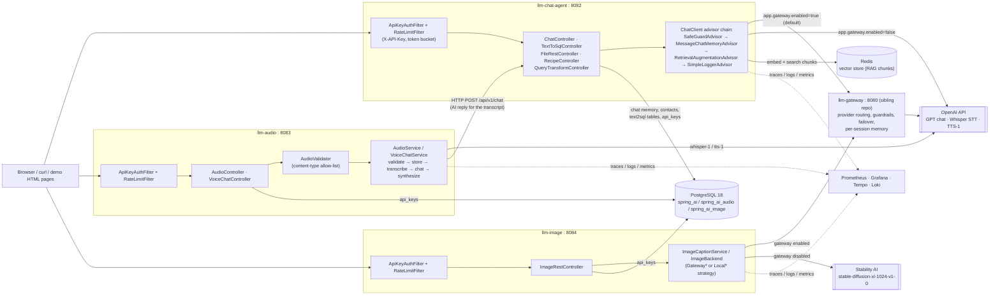
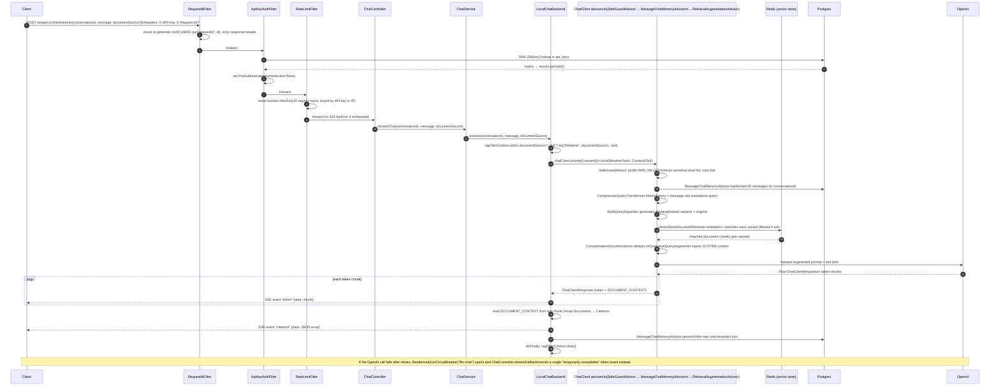

# LLM Chat — Spring AI Production-Grade Backend


## Table of contents

1. 🏗️ [Architecture](#%EF%B8%8F-architecture)
2. 🧰 [Technology Stack](#%EF%B8%8F-technology-stack)
3. 🏗️ [Layout](#%EF%B8%8F-layout)
4. 🚀 [Getting Started](#-getting-started)
5. 🔐 [Authentication](#-authentication)
6. 🚪 [Routing through llm-gateway](#-routing-through-llm-gateway)
7. 🌐 [Endpoints](#-endpoints)
8. 📨 [Request Flow — Streaming Chat, End to End](#-request-flow--streaming-chat-end-to-end)
9. 📈 [Observability](#-observability)
10. ⚙️ [Configuration](#-configuration)
11. 🧪 [Build & Test](#-build--test)
12. 🧰 [Technology Deep Dive](#technology-deep-dive)

A Maven **multi-module** reactor demonstrating production Spring AI patterns, split into three
independently runnable modules:

| Module | Port | Responsibility |
|---|---|---|
| [`llm-chat-agent`](./llm-chat-agent) | 8082 | Multi-turn chat with persistent memory, streaming, RAG, PDF/file reading, a guarded natural-language **text-to-SQL** endpoint, travel-guide and recipe demos |
| [`llm-audio`](./llm-audio) | 8083 | Audio transcription (Whisper), text-to-speech, and voice chat (calls `llm-chat-agent` over HTTP for the AI reply) |
| [`llm-image`](./llm-image) | 8084 | Image captioning (multimodal chat) and AI image generation (Stability AI / gateway DALL·E) |

All three share this repo's root `pom.xml` (a reactor parent extending `super-pom`), Maven
wrapper, and `docker-compose.yml` (Postgres, Redis, observability stack). Each module is its own
Spring Boot app with its own `application.yml`, API-key auth, and database (`spring_ai`,
`spring_ai_audio`, `spring_ai_image` — see `observability/init-db/`).

> Sibling services: [`llm-gateway`](../llm-gateway) (multi-provider routing + guardrails) and
> [`llm-rag-pipeline`](../llm-rag-pipeline) (ingestion + retrieval). This repo follows the same
> security, observability and project conventions as those two.

## 🗺️ Architecture

The reactor is three independently deployable Spring Boot applications that share no runtime
classpath, each fronted by its own security filter chain (`ApiKeyAuthFilter` → `RateLimitFilter`)
and each free to call out to OpenAI/Stability AI directly or through the sibling `llm-gateway`
service, selected per module by `app.gateway.enabled`. `llm-audio`'s voice-chat flow is the one
place a module calls *another module in this repo* rather than an external provider — it delegates
the actual chat reasoning to `llm-chat-agent` over plain HTTP.



Key things the diagram makes explicit:

<ul>

- **No shared classpath, shared infrastructure.** All three apps talk to the *same* Postgres
  instance and the *same* Redis instance, but each owns its own database/table set and, in
  Redis's case, only `llm-chat-agent` actually uses the vector index.
- **`llm-audio` is the only module that calls a sibling module in this repo.** `VoiceChatService`
  calls `ChatAgentClient`, a `WebClient`-backed HTTP client pointed at `llm-chat-agent`'s
  `/api/v1/chat` endpoint — the voice pipeline transcribes locally, then reuses `llm-chat-agent`
  for the actual LLM reasoning rather than duplicating chat logic.
- **The gateway is opt-out, not opt-in.** `app.gateway.enabled` defaults to `true` in
  `application.yml`, so a fresh checkout of `llm-chat-agent` or `llm-image` routes through
  `llm-gateway` unless a developer explicitly flips it to `false` per module.
- **Every module fronts every request with the same two filters** (`ApiKeyAuthFilter`,
  `RateLimitFilter`) — copy-pasted per module rather than shared as a library, since these are
  separate deployables that must be independently buildable and versionable.

</ul>

## 🛠️ Technology Stack

<ul>

- **Spring Boot** 4.1.0 · **Spring AI** 2.0.0 · **Java** 25 · **Maven**
- **OpenAI** (chat, audio) · **Stability AI** (image generation)
- **PostgreSQL** — chat memory, contacts, text-to-SQL data, API keys
- **Redis** — vector store (for RAG-backed advisors)
- **Spring Security** — API-key authentication (`X-API-Key`) + in-memory rate limiting
- **Observability**: Micrometer + Prometheus + Grafana + Tempo (traces) + Loki (logs)

</ul>

## 🏗️ Layout

Each module is a self-contained Spring Boot app under `com.org.llm.*`; the package name repeats
across modules but they never share a classpath at runtime.

<ul>

- **`llm-chat-agent/`** — `controller/` (chat, file, recipe, text-to-sql, RAG query-transform
  playground), `service/` (`ChatService`, `TravelGuideService`, `TextToSqlService`,
  `FileReadService`, …), `backend/` — **Strategy** pattern for where chat/travel-guide work
  executes (`ChatBackend`, `TravelPlanBackend`, each with a `Gateway*` and a `Local*`
  implementation, selected at startup by `app.gateway.enabled`), `rag/` (query transformer
  strategies + `RagFilterContext`), `tool/` (weather, contacts), `config/` (`AIConfig`,
  `RagConfig`, `RedisConfig`, `StartupValidator`).
- **`llm-audio/`** — `controller/` (`AudioController`, `VoiceChatController`), `service/`
  (`AudioService`, `VoiceChatService` — validate → store → transcribe → chat → synthesize),
  `client/ChatAgentClient` (calls `llm-chat-agent`'s `/chat` endpoint over HTTP for the AI reply).
- **`llm-image/`** — `controller/ImageRestController`, `service/ImageCaptionService`,
  `backend/ImageBackend` (`Gateway*`/`Local*` Stability AI strategy).
- **Shared per module** (each module has its own copy — they're separate deployables, not a
  shared library): `security/` (`ApiKeyService`, `ApiKeyAuthFilter`, `RateLimitFilter`,
  `SecurityConfig`, `RestAuthenticationEntryPoint`), `exception/` (`GlobalExceptionHandler` +
  `ApiError`), `web/RequestIdFilter`, `config/ObservabilityConfig` + `AsyncConfig`.

</ul>

## 🚀 Getting Started

### 1. Start infrastructure

```bash
docker compose up -d        # Postgres, Redis, RedisInsight + Prometheus/Grafana/Tempo/Loki
```

### 2. Configure secrets

```bash
export OPENAI_API_KEY=sk-...
export STABILITYAI_API_KEY=sk-...     # only for llm-image generation
export WEATHER_API_KEY=...            # only for llm-chat-agent's weather tool
```

### 3. Run each module you need

```bash
./mvnw -pl llm-chat-agent spring-boot:run    # port 8082
./mvnw -pl llm-audio spring-boot:run         # port 8083 — calls llm-chat-agent for voice-chat replies
./mvnw -pl llm-image spring-boot:run         # port 8084
```

Or build/test the whole reactor from the root: `./mvnw verify`. Each module serves under context
path **`/ai`** on its own port (e.g. http://localhost:8082/ai).

## 🔑 Authentication

<ul>

- API-key auth is **enabled by default** in every module — each request must include `X-API-Key`
- Excluded from auth: actuator endpoints, the demo static HTML pages, and `/error`
- Keys are stored as SHA-256 hashes in each module's own `api_keys` PostgreSQL table (separate
  databases — `spring_ai`, `spring_ai_audio`, `spring_ai_image` — so a key minted for one module
  doesn't work on another) — raw values are never persisted
- Flyway seeds a **development key** per module, ready to use immediately:

</ul>

```
llm-chat-agent: X-API-Key: llm-chat-dev-key-2026
llm-audio:      X-API-Key: llm-audio-dev-key-2026
llm-image:      X-API-Key: llm-image-dev-key-2026
```

```bash
curl -s "http://localhost:8082/ai/api/v1/recipe?ingredients=eggs,flour" \
  -H "X-API-Key: llm-chat-dev-key-2026"
```

Mint a real key (against the relevant module's database):

```bash
raw=$(openssl rand -hex 32)
hash=$(printf "%s" "$raw" | shasum -a 256 | cut -d' ' -f1)
psql -h localhost -U postgres -d spring_ai \
  -c "INSERT INTO api_keys (key_hash, label) VALUES ('$hash', 'my-client');"
echo "X-API-Key: $raw"
```

<ul>

- To disable auth for local development: set `API_AUTH_ENABLED=false` (or `app.security.auth-enabled=false`)
- The demo HTML UIs under `/ai/*.html` assume an open instance or that you inject the dev key directly

</ul>

## 🔀 Routing through llm-gateway

<ul>

- By default (`app.gateway.enabled=true`), `llm-chat-agent`'s chat/structured travel-guide and
  `llm-image`'s image generation are **routed through `llm-gateway`** rather than calling
  OpenAI/Stability directly
- The gateway owns provider API keys, guardrails, failover logic, and per-session memory — centralising those concerns outside these services
- When `GATEWAY_ENABLED=false`, the module calls its provider directly (the original behaviour)
- `llm-image`'s captioning, `llm-audio`'s transcription/TTS, and `llm-chat-agent`'s file reading **always run locally** — the gateway exposes no such endpoints

</ul>

| Flow                                  | Gateway call                          |
|----------------------------------------|---------------------------------------|
| `llm-chat-agent` `/chat`               | `POST /llm/chat` (session = `conversationId`) |
| `llm-chat-agent` `/chat/stream`        | `POST /llm/{provider}/stream` (SSE)   |
| `llm-chat-agent` `/chat/travel-guide`  | `POST /llm/query` (strict-JSON → `TravelPlan`) |
| `llm-image` `/images/generate`         | `POST /llm/image` (OpenAI DALL·E)     |

<ul>

- Configure via `app.gateway.*` env vars: `GATEWAY_ENABLED`, `GATEWAY_BASE_URL`, `GATEWAY_API_KEY`, `GATEWAY_PROVIDER`, `GATEWAY_MODEL` (`llm-image` also has `GATEWAY_IMAGE_MODEL`)
- Recommended run order for the full stack: `llm-gateway` (8080) → `llm-chat-agent` (8082) → `llm-audio` (8083) / `llm-image` (8084)

</ul>

## 📡 Endpoints

### `llm-chat-agent` (port 8082, under `/ai`)

| Method | Path                  | Description                                    |
|--------|-----------------------|------------------------------------------------|
| POST   | `/api/v1/chat`               | Multi-turn chat (memory via `conversationId`)  |
| POST   | `/api/v1/chat/stream`        | Server-sent streaming chat                     |
| GET    | `/api/v1/chat/memory`        | Inspect conversation memory                    |
| GET    | `/api/v1/chat/travel-guide`  | Structured travel-guide response               |
| POST   | `/api/v1/files/read`          | Read/summarise an uploaded file                |
| GET    | `/api/v1/recipe`             | Generate a recipe from ingredients             |
| POST   | `/api/v1/sql`                 | NL → guarded read-only SQL + results           |
| POST   | `/api/v1/rag/query-transform` | Run a query through a single pre-retrieval transformer (rewrite/translate/compress/multi-query-expand) |

### `llm-audio` (port 8083, under `/ai`)

| Method | Path                  | Description                                    |
|--------|-----------------------|------------------------------------------------|
| POST   | `/api/v1/chat/audio`         | Chat with audio input (calls `llm-chat-agent` for the reply) |
| POST   | `/api/v1/chat/audio/voice`   | Voice-to-voice chat                            |
| POST   | `/api/v1/audio/to-text`      | Transcribe audio                               |
| POST   | `/api/v1/audio/to-speech`    | Text-to-speech                                 |
| POST   | `/api/v1/audio/upload`       | Upload + process an audio file                 |

### `llm-image` (port 8084, under `/ai`)

| Method | Path                  | Description                                    |
|--------|-----------------------|------------------------------------------------|
| POST   | `/api/v1/images/caption`      | Caption an image                               |
| GET    | `/api/v1/images/generate`     | Generate an image (gateway DALL·E, or Stability if gateway off) |

## 🔄 Request Flow — Streaming Chat, End to End

The richest single request path in this repo is `POST /ai/api/v1/chat/stream` on
`llm-chat-agent` when running in **direct mode** (`app.gateway.enabled=false`) — it is the one
flow that exercises the security filters, the guardrail advisor, JDBC-backed memory, the
compress → expand → retrieve RAG pipeline, tool calling, and Server-Sent Event streaming all in
one call. (With the gateway enabled — the default — `GatewayChatBackend` replaces the advisor
chain with a single SSE proxy call to `llm-gateway`'s `/llm/{provider}/stream`; the filter chain,
controller and streaming contract are otherwise identical.)



Notable details this flow surfaces that aren't visible from the endpoint table alone:

1. **Guardrail runs before anything touches state.** `SafeGuardAdvisor.order(Integer.MIN_VALUE)`
   guarantees the sensitive-word check fires before `MessageChatMemoryAdvisor` even queries
   Postgres — a blocked prompt never reaches the database or the model.
2. **Streaming doesn't sacrifice citations.** `RetrievalAugmentationAdvisor`'s retrieval runs once
   up front and stashes the retrieved `Document`s in the advisor context under
   `DOCUMENT_CONTEXT`; `LocalChatBackend` reads that context off the *last* streamed chunk and
   emits it as one trailing `citations` SSE event after all `token` events, so the token-by-token
   UX is never blocked waiting on citation formatting.
3. **The `RagFilterContext` `ThreadLocal` is what makes per-request document scoping possible**
   on a *singleton* `VectorStoreDocumentRetriever` bean — the filter is set before the call and
   cleared in `doFinally`, so concurrent requests with different `documentSource` values never
   see each other's filter.
4. **Resilience lives one layer above the advisor chain.** `ChatController.streamChat` is wrapped
   in `@CircuitBreaker(name = "llm-chat")` (10-call sliding window, 50% failure threshold, 10s
   open-state wait, 3 half-open probes — configured in `application.yml` under
   `resilience4j.circuitbreaker.instances.llm-chat`) with `streamFallback` returning a single
   graceful SSE token instead of a broken stream or a 5xx.

## 📊 Observability

See [`PROMETHEUS_GRAFANA_SETUP.md`](./PROMETHEUS_GRAFANA_SETUP.md). Health at
`/ai/actuator/health`, Prometheus scrape at `/ai/actuator/prometheus`, Grafana at
http://localhost:3000 (admin/admin) with the auto-provisioned **LLM Chat** dashboard.

### Actuator endpoints

| Endpoint | Description |
|---|---|
| `/ai/actuator/health` | Full component health (DB, Redis, liveness/readiness probes) |
| `/ai/actuator/info` | Build info (version, time), git info (branch, commit, dirty flag), Java/OS details |
| `/ai/actuator/metrics` | Micrometer metrics |
| `/ai/actuator/prometheus` | Prometheus scrape target |

<ul>

- `/actuator/info` is enriched at build time by `spring-boot-maven-plugin` (`build-info` goal) and `git-commit-id-maven-plugin`
- Run `./mvnw package` to populate build timestamp, version, and Git commit details into the info endpoint

</ul>

## 🧱 Configuration

<ul>

- All tunables live in `application.yml` and accept environment variable overrides at runtime
- Key environment variables: `SERVER_PORT`, `POSTGRES_*`, `REDIS_*`, `API_AUTH_ENABLED`, `RATE_LIMIT_ENABLED`, `CORS_ALLOWED_ORIGINS`, `OTEL_EXPORTER_OTLP_ENDPOINT`
- No rebuild required — all knobs are externalised and take effect on the next startup

</ul>

## ✅ Build & Test

```bash
./mvnw verify        # compile, test, JaCoCo coverage report (target/site/jacoco)
```

<ul>

- Integration tests use **Testcontainers** (`TestcontainersConfiguration` + `@ServiceConnection`)
- A throwaway `postgres:18` container is started per test run — no locally provisioned database needed, only Docker
- Flyway migrations, the JDBC chat-memory schema, and all JDBC queries in tests run against the real Postgres 18 container
- Validator logic (`SqlValidator`, `AudioValidator`) is covered by plain unit tests with no container dependency

</ul>

<a id="technology-deep-dive"></a>
## 12. 🧰 Technology Deep Dive

This section explains every significant library, framework, database, and infrastructure component used in this project — what it is and exactly how it is wired up here.

---

### Spring Boot 4.1.0

**What it is.**

<ul>

- Spring Boot is an opinionated framework that auto-configures a production-ready Java application from a single `main` class and a classpath of starter JARs
- Version 4.x requires Java 17+ and brings the `jakarta.*` namespace (Jakarta EE 11); this project runs on Java 25
- Auto-configuration is now further modularised — each technology ships its own auto-config module rather than bundling everything in one jar

</ul>

**How it's used here.**

<ul>

- Entry point is `LLMApplication`; `spring-boot-starter-web` stands up a Tomcat servlet container on port 8082 under context path `/ai`
- `spring-boot-starter-validation` enables `@Valid` on controller method parameters for automatic request-body validation
- `server.shutdown: graceful` with a 30-second drain window ensures rolling deployments do not drop in-flight requests
- The Spring Boot Maven plugin is configured with the `build-info` goal so `/ai/actuator/info` reports build timestamp, version, and Git commit

</ul>

---

### Spring AI 2.0.0

**What it is.**

<ul>

- Spring AI is the official Spring integration layer for large-language models and AI services
- Provides a provider-neutral `ChatClient` abstraction, chat-memory advisors, document readers, vector store abstractions, audio model wrappers, image model wrappers, and a `@Tool` annotation for function calling
- All components follow standard Spring conventions — dependency injection, auto-configuration, `application.yml` properties

</ul>

**How it's used here.**

<ul>

- **`ChatClient`** (configured in `AIConfig`) is built from `OpenAiChatModel` and pre-loaded with three default advisors:
  - `SafeGuardAdvisor` — blocks known jailbreak phrases before any processing
  - `MessageChatMemoryAdvisor` — enriches every prompt with per-conversation history retrieved from PostgreSQL
  - `SimpleLoggerAdvisor` — logs request/response pairs for observability
- **`JdbcChatMemoryRepository` + `MessageWindowChatMemory`** persist conversation history to PostgreSQL and cap the window at 50 messages so memory survives restarts
- **`OpenAiAudioTranscriptionModel` / `OpenAiAudioSpeechModel`** are injected directly into `AudioService` to call Whisper (speech-to-text) and TTS-1 (text-to-speech) via Spring AI's audio abstraction
- **`spring-ai-pdf-document-reader`, `spring-ai-markdown-document-reader`, `spring-ai-tika-document-reader`** are available for the file-reading and RAG-backed advisor flows
- **`spring-ai-starter-vector-store-redis`** wires a Redis vector store that the RAG advisor can query for context from uploaded PDFs
- **`spring-ai-rag`** provides the modular RAG building blocks — `RetrievalAugmentationAdvisor`, `VectorStoreDocumentRetriever`, `ConcatenationDocumentJoiner`, `ContextualQueryAugmenter`, and the pre-retrieval query transformers/expander (`CompressionQueryTransformer`, `RewriteQueryTransformer`, `TranslationQueryTransformer`, `MultiQueryExpander`) — used to make retrieval history-aware and exposed individually via the query-transformation playground (see below)
- **`FilterExpressionBuilder`** (from `spring-ai-vector-store`) scopes a single chat turn's retrieval to one document by `fileName` metadata, via `RagFilterContext` (see "Per-request document filtering" below)
- **`PromptTemplate`** loads the `travel-guide.st` StringTemplate file and fills `{city}` / `{days}` placeholders before passing the prompt to the travel-plan backend
- **`@Tool`** on `WeatherTools.getWeather` and `ContactsTool.findContactsByCity` registers those methods as callable functions the LLM can invoke during a chat turn

</ul>

**Advisor chain ordering**

The three default advisors fire in a fixed order on every `ChatClient` call:

| Order | Advisor | Role |
|---|---|---|
| `Integer.MIN_VALUE` | `SafeGuardAdvisor` | Runs first — blocks jailbreak / prompt-injection phrases before any memory lookup or model call is made |
| default | `MessageChatMemoryAdvisor` | Fetches the last 50 messages for the `conversationId` from PostgreSQL and prepends them to the prompt as `USER`/`ASSISTANT` turns |
| default | `SimpleLoggerAdvisor` | Logs full request and response pairs at `DEBUG` level for observability; runs last so it captures the fully assembled prompt |

`SafeGuardAdvisor.order(Integer.MIN_VALUE)` guarantees the guard fires before memory is even consulted — a blocked request never touches the database.

**History-aware RAG on the chat and streaming endpoints**

`LocalChatBackend.chat()` / `.stream()` attach a `RetrievalAugmentationAdvisor` on every call (configured in `RagConfig`):

```java
chatClient.prompt()
    .advisors(spec -> spec
            .advisors(retrievalAugmentationAdvisor)
            .param(ChatMemory.CONVERSATION_ID, conversationId))
    .stream()
    ...
```

Multi-turn messages ("what about the second one?") have no standalone meaning, so embedding them as-is against the vector store returns poor matches, and a single phrasing of a query can miss relevant chunks that use different wording. `RagConfig` wires the advisor as a **compress → expand → retrieve (per variant) → join → augment → generate** pipeline instead of a single opaque step:

```java
@Bean
public RetrievalAugmentationAdvisor retrievalAugmentationAdvisor(VectorStore vectorStore,
                                                                  CompressionQueryTransformer compressionQueryTransformer,
                                                                  MultiQueryExpander multiQueryExpander,
                                                                  RagFilterContext ragFilterContext) {
    return RetrievalAugmentationAdvisor.builder()
            .queryTransformers(compressionQueryTransformer)
            .queryExpander(multiQueryExpander)
            .documentRetriever(VectorStoreDocumentRetriever.builder()
                    .vectorStore(vectorStore)
                    .filterExpression(ragFilterContext::get)
                    .build())
            .documentJoiner(new ConcatenationDocumentJoiner())
            .queryAugmenter(ContextualQueryAugmenter.builder().allowEmptyContext(true).build())
            .build();
}
```

Because `RetrievalAugmentationAdvisor` is added per-call *after* the chat client's default `MessageChatMemoryAdvisor`, the prompt it sees already has the last 50 messages for the conversation prepended.

1. `CompressionQueryTransformer` folds that history plus the current message into one standalone query with an LLM call (e.g. *"what about the second one?"* → *"What are the details of the second leave type in NexaCorp's leave policy?"*)
2. `MultiQueryExpander` takes that standalone query and generates 3 paraphrased variants plus the original (`numberOfQueries(3)`, `includeOriginal(true)`), to improve recall against phrasing-sensitive embeddings
3. `VectorStoreDocumentRetriever` embeds **each** variant and searches the Redis index (pre-loaded from `AtlasCorp-TravelPolicy.pdf` and `AtlasCorp_Events_Holidays.pdf`) independently, optionally narrowed by the active `RagFilterContext` filter (see below)
4. `ConcatenationDocumentJoiner` merges the per-variant result lists into one deduplicated document set
5. `ContextualQueryAugmenter` injects the joined chunks as a `SYSTEM` context block before the first token is streamed

Two things worth calling out:
<ul>

- Compression and expansion only change what's sent to the retriever — the user's original message text is still what gets stored in `ChatMemory`, so conversation history isn't silently rewritten.
- `allowEmptyContext(true)` keeps the advisor permissive: if retrieval finds nothing relevant (e.g. small talk), the model still answers instead of refusing.

</ul>

**Per-request document filtering (`FilterExpressionBuilder`)**

`ChatRequest.documentSource` lets a caller scope a single chat turn's retrieval to one pre-loaded document, instead of searching across all of them:

```json
POST /api/v1/chat
{
  "conversationId": "conv-1",
  "message": "How many days of annual leave do I get?",
  "documentSource": "AtlasCorp-TravelPolicy.pdf"
}
```

The `VectorStoreDocumentRetriever` bean in `RagConfig` is a singleton, but the filter is per-request, so it can't be passed as a fixed builder argument. Instead, `filterExpression(Supplier<Filter.Expression>)` is wired to `ragFilterContext::get` — a `ThreadLocal` holder (`com.org.llm.rag.RagFilterContext`). `LocalChatBackend` builds a `Filter.Expression` with `new FilterExpressionBuilder().eq("fileName", documentSource).build()` when `documentSource` is present, calls `ragFilterContext.set(...)` before invoking the `ChatClient`, and clears it in a `finally`/`doFinally` block once the call (or stream) completes. When `documentSource` is absent, the supplier returns `null` and retrieval is unfiltered, as before.

**Conversation ID flow**

Each chat request passes `conversationId` through Spring AI's advisor parameter map:

```java
spec.param(ChatMemory.CONVERSATION_ID, conversationId)
```

No per-request state lives in any Spring bean — the ID travels through `AdvisedRequest` metadata and is read by `MessageChatMemoryAdvisor` to fetch and save the correct message window. This is safe for concurrent requests with different conversation IDs on the same `ChatClient` instance.

**Query transformation playground**

`CompressionQueryTransformer` is only one of several pre-retrieval query transformers Spring AI ships under `spring-ai-rag`. `POST /api/v1/rag/query-transform` exposes all four so each can be exercised independently of the main chat flow:

| Technique | Spring AI class | What it does |
|---|---|---|
| `REWRITE` | `RewriteQueryTransformer` | Rewrites a messy/conversational query into a clean, standalone search query |
| `TRANSLATE` | `TranslationQueryTransformer` | Translates the query into the language of the indexed documents (defaults to English) |
| `COMPRESS` | `CompressionQueryTransformer` | Folds conversation history + the current query into one standalone query |
| `MULTI_QUERY_EXPAND` | `MultiQueryExpander` | Generates several paraphrased variants of the query to improve recall |

```json
POST /api/v1/rag/query-transform
{
  "technique": "COMPRESS",
  "query": "what about the second one?",
  "history": ["What is the capital of Denmark?", "Copenhagen is the capital of Denmark."]
}
```

```json
{
  "technique": "COMPRESS",
  "originalQuery": "what about the second one?",
  "transformedQueries": ["What is the second largest city in Denmark?"]
}
```

**Design — Strategy pattern.** Each technique is a `com.org.llm.rag.QueryTransformationStrategy` bean (`RewriteQueryStrategy`, `TranslateQueryStrategy`, `CompressQueryStrategy`, `MultiQueryExpansionStrategy`), tagged by a `QueryTransformationTechnique` enum value. `QueryTransformationService` collects all of them via constructor injection (`List<QueryTransformationStrategy>`) into a `Map<QueryTransformationTechnique, QueryTransformationStrategy>` and dispatches each request to the matching one — no `if`/`switch` chain, and adding a fifth technique (e.g. HyDE or step-back prompting) only means adding one more `@Component`, nothing else changes. The four underlying transformer/expander beans live in `RagConfig`, built from a shared low-temperature `ChatClient.Builder` (`ragChatClientBuilder`) so transformation calls stay deterministic and never touch the main conversation's options. `RewriteQueryTransformer` and `MultiQueryExpander` are configured once as singletons; `TranslationQueryTransformer` is built per-request inside its strategy because `targetLanguage` varies per call.

This endpoint is a playground for inspecting each technique's raw output — it does not itself touch the vector store. The production retrieval path (`LocalChatBackend.chat()` / `.stream()`) wires `CompressionQueryTransformer` and `MultiQueryExpander` together via the `RetrievalAugmentationAdvisor` bean described above.

---

### OpenAI API

**What it is.**

<ul>

- OpenAI provides GPT-series chat-completion models, the Whisper speech-recognition model, TTS voice-synthesis models, and DALL·E image-generation
- Access is REST-based, authenticated with a bearer token supplied as `OPENAI_API_KEY`

</ul>

**How it's used here.**

<ul>

- In `llm-chat-agent`, when `app.gateway.enabled=false` (direct mode), `LocalChatBackend` calls OpenAI's chat-completion API via `ChatClient`
- In `llm-image`, `LocalImageBackend` calls the image endpoint via the Stability AI or OpenAI image model
- In `llm-audio`, `AudioService` calls Whisper with model `whisper-1` for transcription and `tts-1` with voice `echo` for speech synthesis
- The API key is read from `OPENAI_API_KEY` (each module reads its own copy of the env var) and kept only in Spring AI auto-configuration — it never appears in business code
- Each module's own `StartupValidator` fails the application at boot if its required key is missing, giving an immediate and unambiguous error

</ul>

---

### Stability AI

**What it is.**

<ul>

- Stability AI offers image-generation REST APIs including Stable Diffusion XL
- Spring AI bundles a `spring-ai-starter-model-stability-ai` dependency that wraps the HTTP calls into a typed model interface

</ul>

**How it's used here.**

<ul>

- `llm-image`'s `LocalImageBackend` calls `StabilityAiImageModel` to generate images when the gateway is disabled
- The configured model is `stable-diffusion-xl-1024-v1-0`, set in `llm-image/application.yml` under `spring.ai.stabilityai.image.options.model`
- When the gateway is enabled, image generation is re-routed through `GatewayImageBackend`, which calls the gateway's `/llm/image` endpoint requesting DALL·E 3 instead

</ul>

---

### PostgreSQL 18

**What it is.**

<ul>

- PostgreSQL is an open-source relational database; version 18 stores data in a versioned sub-directory inside the data volume, which is why the Docker volume mounts the parent path `/var/lib/postgresql`

</ul>

**How it's used here.** A single Postgres instance (from the root `docker-compose.yml`) hosts one
database per module, each with its own Flyway history table so migrations never collide:

| Database | Module | Tables |
|---|---|---|
| `spring_ai` | `llm-chat-agent` | `spring_ai_chat_memory` (chat history, auto-created by Spring AI), `contacts` (weather/contacts tool seed data), `text2sql_customers / products / orders / order_items` (demo e-commerce schema), `api_keys` |
| `spring_ai_audio` | `llm-audio` | `api_keys` |
| `spring_ai_image` | `llm-image` | `api_keys` |

The `spring_ai_audio` and `spring_ai_image` databases are created on first container start by
`observability/init-db/01-create-module-databases.sql` (mounted into
`/docker-entrypoint-initdb.d`) — drop the `postgres_data` volume to re-run it against a fresh
instance. Each module's `api_keys` table is independent, so a key minted for one module doesn't
authenticate against another.

<ul>

- `JdbcTemplate` (no ORM) is used for all custom SQL: key lookups, contacts queries, text-to-SQL execution, and schema introspection at runtime
- The `pgcrypto` extension is enabled in migration V5 to hash the development seed key inline

</ul>

---

### Flyway

**What it is.**

<ul>

- Flyway is a database-migration tool that tracks which SQL scripts have been applied via a version-history table and runs any pending ones at application startup
- Prevents schema drift between environments by making migrations automatic and auditable

</ul>

**How it's used here.**

<ul>

- Five versioned scripts (`V1` through `V5`) under `src/main/resources/db/migration` set up all tables and seed data
- A separate history table (`flyway_schema_history_chat`) is used — distinct from the gateway and RAG services — so all three sibling services can share the same Postgres instance without migration-history conflicts
- `baseline-on-migrate: true` allows Flyway to adopt an already-initialised schema on first run without failing
- Spring Boot 4 requires the `spring-boot-flyway` module explicitly on the classpath — `flyway-core` alone no longer triggers `FlywayAutoConfiguration`

</ul>

---

### Redis

**What it is.**

<ul>

- Redis is an in-memory data structure store used here in two distinct roles: as a persistent key-value / list store with AOF durability, and as a vector database via the RediSearch module

</ul>

**How it's used here.**

<ul>

- **Vector store**: `spring-ai-starter-vector-store-redis` initialises a vector index on startup (`initialize-schema: true`) so the RAG advisor can embed and retrieve document chunks from uploaded PDFs (e.g., `AtlasCorp-TravelPolicy.pdf`)
- **Connection**: `RedisConfig` creates a `JedisConnectionFactory` (using the Jedis client) pointing at `localhost:6379` by default, overridable via `REDIS_HOST` / `REDIS_PORT`
- **Docker**: Redis is started with `appendonly yes` (AOF persistence), a 512 MB memory cap, and an `allkeys-lru` eviction policy so vector data survives restarts and old entries are evicted gracefully under memory pressure
- **RedisInsight**: A companion `redis/redisinsight` container (port 5540) provides a browser UI for inspecting vector-store contents during development

</ul>

---

### Spring Security

**What it is.**

<ul>

- Spring Security is the standard authentication and authorisation framework for Spring applications
- Works through a chain of servlet filters that intercept every request before it reaches a controller

</ul>

**How it's used here.** The project implements a custom, database-backed API-key scheme instead of session or JWT:

1. **`ApiKeyAuthFilter`** reads the `X-API-Key` header, calls `ApiKeyService.isValid`, and if valid sets a `PreAuthenticatedAuthenticationToken` in the `SecurityContextHolder`; also calls `touchLastUsed` to stamp the row
2. **`ApiKeyService`** hashes the raw key with SHA-256 (using `MessageDigest`) and checks the `api_keys` table via `JdbcTemplate` — raw keys are never stored
3. **`RateLimitFilter`** applies a token-bucket rate limiter (120 requests/minute burst) per API key (or client IP when no key is present); the bucket is an in-memory `ConcurrentHashMap` of hand-rolled `Bucket` objects — no Resilience4j or Bucket4j dependency; returns `429` with a JSON `ApiError` on exhaustion
4. **`SecurityConfig`** declares which paths are open (actuator, static HTML, `/error`) and which require authentication; also configures CORS (`CORS_ALLOWED_ORIGINS`) and security headers
5. **`RestAuthenticationEntryPoint`** returns a structured JSON `{"status":401,...}` error rather than the default HTML challenge page
<ul>

- Auth can be fully disabled for local development via `API_AUTH_ENABLED=false`

</ul>

---

### Request Validation, Correlation & Guardrails

**What this covers.**

Beyond authentication (`ApiKeyAuthFilter`) and rate limiting (`RateLimitFilter`, both described
above), each module layers on request-correlation, input-validation, and LLM-output-guardrail
logic that is easy to miss from the endpoint table alone. All of the classes below are plain,
dependency-light Java — no external validation framework beyond `jakarta.validation` and
`java.util.regex`.

**`RequestIdFilter` — correlation IDs (`web/RequestIdFilter.java`, identical in all three modules)**

<ul>

- Registered as a `@Component` with `@Order(Ordered.HIGHEST_PRECEDENCE)`, so it runs before
  `ApiKeyAuthFilter` and `RateLimitFilter` in the servlet filter chain
- Reads the incoming `X-Request-ID` header; if the caller didn't supply one, generates a random
  `UUID`
- Stores the ID under the SLF4J `MDC` key `requestId` for the lifetime of the request, so every
  log line emitted while handling it — from the security filters down through the service and
  advisor layers — carries the same correlation ID (see the `logging.pattern.console` layout,
  which interleaves `requestId`, `traceId`, and `spanId`)
- Echoes the ID back to the caller on the `X-Request-ID` response header, and clears the MDC entry
  in a `finally` block so it never leaks onto the thread for the next pooled request
- This is what lets an operator grep one `requestId` across `logs/llm-chat.json` (Loki) and land on
  the exact matching trace in Tempo, even for requests that touch multiple advisors and a
  downstream HTTP call

</ul>

**`SqlValidator` — the text-to-SQL guardrail pipeline (`llm-chat-agent`, `validation/SqlValidator.java`)**

`TextToSqlService.process()` asks the model to translate a natural-language question into SQL,
then never executes what the model returned without running it through `SqlValidator.prepare()`
first — a three-stage pipeline, each stage independently unit-tested (`SqlValidatorTest`):

1. **`sanitize`** — strips ` ```sql ` / ` ``` ` code-fence markers the model sometimes wraps
   output in, trims whitespace, and removes a single trailing semicolon; throws
   `SqlValidationException("model did not return SQL")` on a blank response
2. **`validateReadOnly`** — enforces the guardrail proper:
   - The statement must start with `select` or `with` (case-insensitive) — anything else is
     rejected outright
   - A regex (`FORBIDDEN_PATTERN`) rejects the statement if it contains `insert`, `update`,
     `delete`, `drop`, `alter`, `truncate`, `create`, `grant`, `revoke`, `copy`, `call`, `do`,
     `vacuum`, or `analyze` as a whole word anywhere in the text — this catches mutating
     statements hidden inside a CTE or subquery, not just at the start of the string
   - A literal `;` anywhere in the SQL is rejected, blocking stacked/multiple statements
   - Every table referenced after a `FROM` or `JOIN` keyword is extracted via regex and checked
     against a **hard-coded allow-list** of four tables
     (`text2sql_customers`, `text2sql_products`, `text2sql_orders`, `text2sql_order_items`); a
     query cannot escape the demo schema even if it's syntactically valid read-only SQL
3. **`enforceLimit`** — appends `LIMIT <maxRows>` to the query unless it already has an explicit
   `LIMIT` clause or is a `SELECT COUNT(...)` aggregate (which returns exactly one row regardless);
   `maxRows` itself is clamped server-side to `[1, 200]` by `TextToSqlService.normalizeMaxRows`,
   so a caller cannot request unbounded result sets even by passing a huge number

If the guarded SQL still fails at execution time with a `BadSqlGrammarException` (e.g. the model
picked a column that doesn't exist), `TextToSqlService.repairSql()` sends the error message and
the offending SQL back to the model for one repair attempt, and the repaired SQL is put through
the **exact same** `SqlValidator.prepare()` guardrail before being executed — there's no bypass
path for the self-healing retry. Any `SqlValidationException` raised anywhere in the pipeline is
translated to a `400` JSON `ApiError` by `GlobalExceptionHandler`, never a raw stack trace.

**`AudioValidator` — upload content-type guardrail (`llm-audio`, `validation/AudioValidator.java`)**

<ul>

- Called at the very start of `VoiceChatService.exchange()` and `AudioService`'s upload path,
  before the file ever touches disk
- Rejects a null or empty `MultipartFile` with `AudioValidationException("audio file must not be
  empty")`
- Checks the multipart `Content-Type` header against a fixed allow-list — `audio/mpeg`,
  `audio/mp4`, `audio/wav`, `audio/x-wav`, `audio/ogg`, `audio/webm`, `audio/flac`, `audio/x-m4a`
  — rejecting anything else (including a missing content type) with a `400` naming the allowed set
- `AudioService.store()` additionally strips the client-supplied filename down to its last path
  segment (`Path.of(name).getFileName()`) before writing to disk, closing off path-traversal via a
  crafted `../../` filename even though that's not `AudioValidator`'s own job
- Covered by `AudioValidatorTest` with no container or Spring context required — pure unit tests
  against a mocked `MultipartFile`

</ul>

**`SafeGuardAdvisor` — LLM-level guardrail (`llm-chat-agent`, configured in `AIConfig`)**

Already introduced under "Spring AI 2.0.0" above; called out again here because it's the guardrail
that runs *before* validation of any kind touches the request — see the "Advisor chain ordering"
table and the streaming sequence diagram above for exactly when it fires relative to memory lookup
and the model call. It matches on a fixed phrase list (`"ignore previous instructions"`,
`"jailbreak"`, `"prompt injection"`) rather than a regex or model-based classifier — a deliberately
simple, deterministic first line of defense.

**Resilience4j — circuit breaker & retry (all three modules, `resilience4j.*` in `application.yml`)**

<ul>

- The `llm-chat` circuit-breaker instance guards `ChatService.chat/streamChat` and
  `ChatController.streamChat`: a 10-call sliding window, 50% failure-rate threshold, 10-second
  open-state wait, 3 permitted calls while half-open, and a 5-call minimum before it can trip at
  all — tuned to avoid flapping on a handful of slow calls
  - `ChatService`'s fallback methods return a graceful `ChatAnswer`/empty-citations response;
    `ChatController.streamFallback` emits a single SSE `token` event reading "I'm temporarily
    unavailable" instead of tearing down the stream with a 5xx
- The `llm-chat` retry instance retries up to 3 times with a 500ms wait, but **only** for
  `IOException` and `ResourceAccessException` — retrying blindly on every exception type would
  re-run non-idempotent-looking failures (e.g. a guardrail rejection) needlessly
- `llm-audio`'s `VoiceChatService.chat()` wraps its HTTP call to `llm-chat-agent` in its own
  `llm-chat-agent`-named circuit breaker + retry pair, so a slow or down chat-agent degrades
  voice-chat gracefully instead of hanging the audio request indefinitely

</ul>

---

### Micrometer + Prometheus

**What it is.**

<ul>

- Micrometer is the metrics-instrumentation facade for the JVM — analogous to SLF4J for logging
- Prometheus is a time-series metrics database that scrapes HTTP endpoints on a configurable interval

</ul>

**How it's used here.**

<ul>

- `spring-boot-starter-actuator` exposes `/ai/actuator/prometheus` as a Prometheus-format text scrape target
- `micrometer-registry-prometheus` registers the Prometheus `MeterRegistry` with Spring Boot
- `ObservabilityConfig` registers two AOP aspects: `TimedAspect` (activates `@Timed` on service methods to create histograms) and `ObservedAspect` (activates `@Observed` to open tracing spans)
- `micrometer-jvm-extras` adds process-level native memory and thread-count metrics (`process_memory_*`, `process_threads`)
- HTTP SLO buckets are configured at 50ms, 100ms, 200ms, 300ms, 500ms, 1s, 2s, and 5s for the `http.server.requests` histogram, enabling percentile and SLO dashboards in Grafana
- Prometheus scrapes the app every 10 seconds via `observability/prometheus.yml`

</ul>

---

### Grafana

**What it is.**

<ul>

- Grafana is a dashboarding and visualisation platform that can query Prometheus (metrics), Tempo (traces), and Loki (logs) from a single UI
- Supports alerting, annotations, and templated dashboards shareable as JSON

</ul>

**How it's used here.**

<ul>

- A `grafana/grafana` container (port 3000, admin/admin) is provisioned at startup via files under `observability/grafana/provisioning/`
- Prometheus, Tempo, and Loki are auto-configured as data sources — no manual datasource setup required
- The pre-built **LLM Chat** dashboard is loaded automatically so the full observability picture is available immediately after `docker compose up`
- Grafana depends on all three backend services in the Docker Compose definition, so startup ordering is correct

</ul>

---

### Grafana Tempo

**What it is.**

<ul>

- Tempo is a distributed tracing backend that stores and retrieves OpenTelemetry (OTLP) traces
- Designed to be cost-efficient by storing traces on local or object storage without a separate index

</ul>

**How it's used here.**

<ul>

- The app exports traces over OTLP HTTP to `http://localhost:4318/v1/traces` at 100% sampling, configurable via `OTEL_EXPORTER_OTLP_ENDPOINT`
- `micrometer-tracing-bridge-otel` + `opentelemetry-exporter-otlp` wire Micrometer's observation API into OpenTelemetry's SDK, which ships spans to Tempo
- `traceId` and `spanId` from the MDC are included in every log line (both console and JSON) so log lines in Loki can be correlated directly to traces in Tempo
- Tempo is configured in `observability/tempo.yml` with OTLP gRPC (port 4317) and HTTP (port 4318) receivers and 24-hour local trace retention

</ul>

---

### Grafana Loki

**What it is.**

<ul>

- Loki is a log aggregation system designed to work like Prometheus: it indexes only metadata labels rather than full log content, making it highly storage-efficient compared to Elasticsearch

</ul>

**How it's used here.**

<ul>

- `logback-spring.xml` configures two appenders: `ASYNC_CONSOLE` (colour-formatted, buffered through a 512-message queue) and `JSON_FILE` (Logstash JSON format, rolling daily, gzip-compressed, 30-day retention, max 100 MB per file)
- The `logstash-logback-encoder` library serialises each log event as a JSON object embedding `traceId` and `spanId` fields so that Loki log entries can be linked directly to Tempo traces in Grafana
- The JSON files under `logs/` are the source Loki (or a log-shipper sidecar) would tail and push into the aggregation backend

</ul>

---

### Spring WebFlux / Project Reactor (`Flux`)

**What it is.**

<ul>

- Project Reactor is a reactive-streams library for the JVM; `Flux<T>` represents an asynchronous sequence of 0–N items
- Spring WebFlux uses it for non-blocking HTTP handling, allowing a single thread to serve many concurrent in-flight requests

</ul>

**How it's used here.**

<ul>

- The streaming chat endpoint (`/chat/stream`) returns a `Flux<String>` that `ChatBackend` implementations produce
- In `LocalChatBackend`, Spring AI's `ChatClient.stream()` method returns a `Flux<String>` of token chunks directly from the model
- In `GatewayChatBackend`, `WebClient` (Spring's reactive HTTP client) connects to the gateway's SSE stream and returns the same `Flux<String>`
- The controller maps this `Flux` to `MediaType.TEXT_EVENT_STREAM_VALUE` so browsers receive a true Server-Sent Events response
- `WebClient` is also used for all non-streaming gateway calls, where `.block()` converts the reactive result to a blocking call within a configured timeout

</ul>

---

### Apache Tika / PDF and Markdown Document Readers

**What it is.**

<ul>

- Apache Tika is a content-analysis toolkit that can extract text and metadata from hundreds of file formats (PDF, DOCX, HTML, etc.)
- Spring AI's document readers wrap Tika, PDFBox, and a Markdown parser into a unified `DocumentReader` API

</ul>

**How it's used here.**

<ul>

- `spring-ai-tika-document-reader` is on the classpath so the `FileReadService` and RAG flows can ingest arbitrary uploaded files regardless of format
- `spring-ai-pdf-document-reader` provides a dedicated page/paragraph split mode controlled by `app.loader.pdf.mode`
- The pre-loaded corporate travel policy PDFs (`AtlasCorp-TravelPolicy.pdf`, `AtlasCorp_Events_Holidays.pdf`) are referenced as `ClassPathResource` objects for advisor context
- `spring-ai-markdown-document-reader` handles `.md` files in the same unified pipeline

</ul>

---

### JDBC Chat Memory (Spring AI)

**What it is.**

<ul>

- Spring AI's `spring-ai-starter-model-chat-memory-repository-jdbc` module stores conversation messages in a relational table (`spring_ai_chat_memory`) and ships its own DDL
- Configured with `initialize-schema: always` so the table is created automatically without a custom migration

</ul>

**How it's used here.**

<ul>

- `JdbcChatMemoryRepository` is auto-configured and injected into `AIConfig.chatMemory()`, which wraps it in a `MessageWindowChatMemory` with a 50-message window
- The `MessageChatMemoryAdvisor` on every `ChatClient` call looks up the last 50 messages for the `conversationId` parameter passed in each request
- Prior messages are prepended to the prompt as context, and the new exchange is appended after the model responds
- This gives the service stateful multi-turn memory across HTTP requests with no in-process state — memory survives restarts automatically

</ul>

---

### Lombok

**What it is.**

<ul>

- Lombok is a Java annotation processor that generates boilerplate code (constructors, getters, `toString`, `equals/hashCode`, builders, loggers) at compile time
- Reduces source verbosity without adding runtime overhead — all generated code is plain Java bytecode

</ul>

**How it's used here.**

<ul>

- `@RequiredArgsConstructor` on service and component classes generates the constructor used by Spring's constructor injection — no `@Autowired` annotations needed
- `@Slf4j` injects a `log` field backed by SLF4J/Logback into every annotated class
- `@AllArgsConstructor` appears on `AudioService` where all fields need explicit initialisation
- Lombok is excluded from the final fat-jar via `spring-boot-maven-plugin`'s exclude list because it is a compile-time-only tool with no runtime dependency

</ul>

---

### Testcontainers

**What it is.**

<ul>

- Testcontainers is a Java library that starts real Docker containers during JUnit tests and cleans them up afterwards
- `@ServiceConnection` (a Spring Boot 3.1+ annotation) wires the container's dynamic port and credentials directly into the application context with no manual property overriding

</ul>

**How it's used here.**

<ul>

- `TestcontainersConfiguration` defines a `@ServiceConnection PostgreSQLContainer<>("postgres:18")` bean
- When `LLMApplicationTests` loads the context, Spring Boot auto-overrides the datasource URL with the container's random mapped port
- Flyway migrations, the JDBC chat-memory schema, and all JDBC queries in tests run against a real Postgres 18 instance
- The suite is fully self-contained and runs in CI with only Docker available — no locally provisioned database required

</ul>

---

### JaCoCo

**What it is.**

<ul>

- JaCoCo (Java Code Coverage) is a bytecode-instrumentation tool that measures which lines, branches, and instructions are exercised by the test suite
- Produces HTML, XML, and CSV reports consumed by CI pipelines and IDEs

</ul>

**How it's used here.**

<ul>

- The `jacoco-maven-plugin` (version 0.8.13) is configured with two executions: `prepare-agent` (attaches the JaCoCo agent before tests run) and `report` (bound to the `verify` phase, producing HTML/XML reports under `target/site/jacoco`)
- Running `./mvnw verify` compiles, runs all tests, and generates the full coverage report in one step

</ul>

---

### Git Commit ID Maven Plugin

**What it is.**

<ul>

- The `git-commit-id-maven-plugin` reads Git metadata (branch, commit hash, timestamp, dirty flag) at build time and writes it to `git.properties` on the classpath
- Makes every built artifact self-describing — the running application knows exactly which commit it was built from

</ul>

**How it's used here.**

<ul>

- The plugin runs during the `initialize` phase and generates `target/classes/git.properties`
- Spring Boot Actuator's `/ai/actuator/info` endpoint automatically exposes these properties (enabled by `management.info.git.mode: full`)
- Every running instance reports its exact commit, branch, and dirty-flag state — invaluable for verifying deployments and correlating incidents to code changes

</ul>

---

### Docker Compose

**What it is.**

<ul>

- Docker Compose is a tool for defining and running multi-container applications from a single YAML file
- Health checks between services enable controlled startup ordering without manual delays

</ul>

**How it's used here.**

<ul>

- `docker-compose.yml` defines seven services: `postgres` (port 5432), `redis` (port 6379), `redisinsight` (port 5540), `tempo` (ports 3200/4317/4318), `loki` (port 3100), `prometheus` (port 9090), and `grafana` (port 3000)
- All services have health checks so `docker compose up -d` waits for each service to be genuinely ready before marking it as started
- Named volumes (`postgres_data`, `redis_data`, etc.) provide persistence of data across container restarts
- The application itself does **not** run in Compose — it starts separately on the host via `./mvnw spring-boot:run` and reaches containers on `localhost`
- `spring.docker.compose.enabled=false` prevents Spring Boot's built-in Compose integration from re-managing the already-running containers

</ul>
